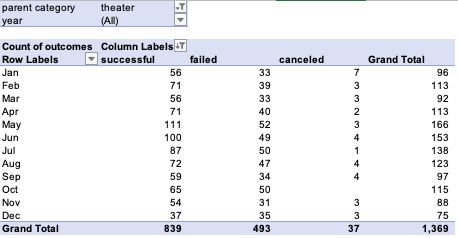

# Kickstarting with Excel

## Overview of Project

### Purpose
The purpose of this project is to explore theater Kickstarter campaign outcomes using two criterias, the launch date of the campaign, and the goal amount to be raised. By analyzing the outcome of campaigns under each criteria, Louise can make an informed decision about how best to run her own theater Kickstarter campaign. The data encompasses Kickstarter campaigns from August 2009 to May 2017, containing 4,114 data points. 

## Analysis and Challenges

### Analysis of Outcomes Based on Launch Date
The first analysis looks at theater campaign outcomes based on the month in which the campaign was launched. The pivot table on the tab 'Theatre_Outcomes_by_Launch_Date' is created using the tab 'Kickstarter'. The pivot table filters on the category Theater. Year is added as a filter as well, but not used in the initial analysis. Launch date is used as rows, and grouped based on months. Outcomes are added as columns and values, resulting in a chart that looks like this:

### Analysis of Outcomes Based on Goals
The second analysis looks at theater campaign outcomes based on the funding goal. The funding goal is divided into groups, starting at $0-$999, $1,000-4,999, and then $5,000 increments ending at $50,000, which the last group being greater than $50,000. For each group, we count the number of successful, failed, and canceled campaigns. For each outcome, the number of campagins as a percentage of total campaigns is calculated for each funding goal group. 

A challenge in the analysis is trying to automate the counting of campaigns for each outcome based on the funding goal group. Two additional columns were added so the conditional formula to count the campaigns can be standardized across most funding goal groups. 

### Challenges and Difficulties Encountered
1. 

## Results

### Outcomes based on Launch Date
- What are two conclusions you can draw about the Outcomes based on Launch Date?
1. Based on the chart Theater Campagins Outcome by Month, the first conclusion is that overall, more campaigns are successful than not. This is represented by the fairly large gap between the successful and failed lines. 

2. The second conclusion is that starting in March, the total number of campaigns start to increase, peaking in May and decreasing thereafter. The larger gap in May between successful and failed campagins seems to indicate that Louise will have more success launching a campaign during this time. There are more campagins competing against each other, but also higher number of campagins that are successful.  

### Outcomes based on Goals
- What can you conclude about the Outcomes based on Goals?
1. In campaigns which have a goal of $14,999 or less, the percentage of campaigns that are successful is higher than those that fail. 

2. In campaigns which have a goal of $20,000 or more, but $34,999 or less, the percentage of campaigns that fail is higher than those that are successful. 

### Limitations on Data
- What are some limitations of this dataset?
1. The most recent entry in this dataset was launched in May 2017. Given it is now October 2021, our dataset is four years outdated. A lot of macro factors could have changed over time, like overall funding goal, interest in crowdfunding in general, average donation. To make an informed decision, we need more timely data. 

2. In the Outcomes based on Goals analysis above, the dataset for groups of campaigns with a goal of more than $25,000 is relatively small compared with the groups with less than $25,000 as the Goal amount. We should investigate the data further to see if our analysis would still hold up. For example, in the group $45,000 to $49,000 in Goal, there is only one campaign, and it was successful. A 100% success rate for this group of campaign goals is not a conclusion we can accurately rely on. 

### Potential for Further Exploration
- What are some other possible tables and/or graphs that we could create?
1. One graph we can create is the percentage of successful campagins by funding goals over time. We want to see if there are any macro trends year over year. Given the limitation identified above regarding the timeliness of data, we should focus on what the most recent data reflects. 

2. Another graph that would be useful is campaign outcomes based on duration of the campagin, using the launched at and deadline data already available. Should a campaign be prolonged to gather more backers, or can a campaign take advantage of the moment to complete its goal. 
